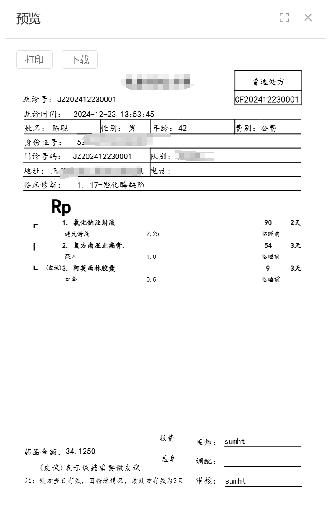
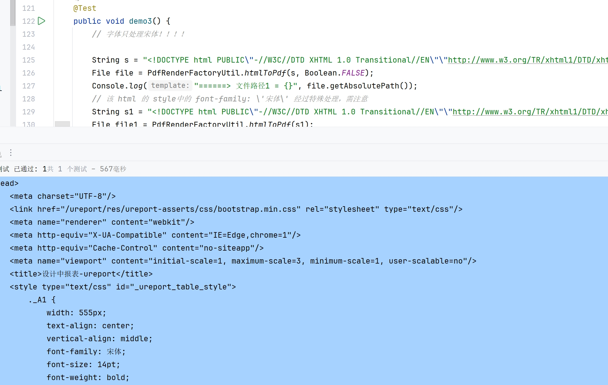
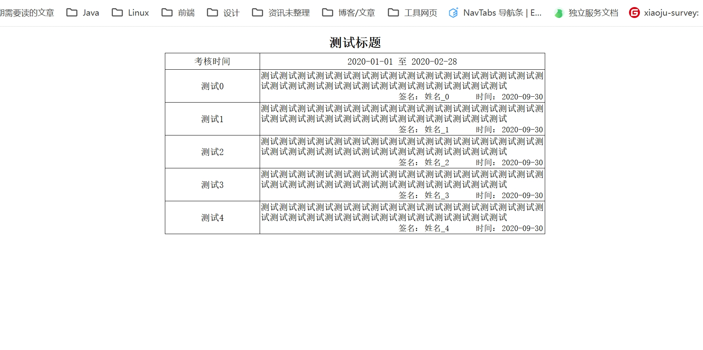

最近在做医院的HIS系统,需要涉及到打印处方笺，病历单等业务需求。原先系统是使用积木报表+poi-tl实现一些文书的功能。
现在调研发现使用poi-tl填充word在转pdf方式性能太差，积木报表样式问题一大堆，并且套打也开始变为商业版功能。所以最总调研下来有以下几种方案

# iText
iText 是一个非常不错的库，可以通过模版的方式实现 PDF 导出，支持 XML/HTML/PDF等模版。
比较有吸引力的是 PDF 模版，PDF 提供了一种表单机制来作为模版使用非常方便。这样可以用 PDF 编辑器实现模版，再用 Java 填充相关字段信息，在很多场景下非常方便。
不过从 iText 5 开始就收费了，iText 提供了商业许可和 AGPL（Affero General Public License）许可，如果软件需要分发，使用了 iText 5 也需要对开发的软件进行开源。
除了通过模版生成 PDF，它的套件还提供了合并文件、优化、擦除等功能。 如果不差钱，iText 是解决 PDF 生成最好的选择。
# Apache PDFBox
Apache PDFBox 是一个开源的 Java 基础库，用于处理 PDF 文档。单独使用 Apache PDFBox 自己编写大量代码，所以可以被用于内容比较简单的情况。
用 PDFBox 的原因也往往是为了处理 PDF，而不是生成 PDF，例如编辑、分割 PDF 文件，从 PDF 文件中提取资源之类的操作 PDFBox 是最好的选择之一。
# JasperReports
其实 JasperReports 是一个很大的报表库，用于生成复杂的报表和文档。它可以从各种数据源获取数据，生成 PDF、HTML、Excel 等多种格式的报表。
支持图表、子报表这些，好像his龙头的杭州创业也是用的这一套,为了少踩坑我们暂时用的也是这一套解决方案。
缺点：就是资料特别少
下面就是一个我们线上打印的效果

# HTML 渲染
相比之下，通过 HTML 的排版能力是一个非常不错的选择。好处在于 HTML 和 CSS 都非常简单，通过 Java 将 HTML 转换为 PDF 性能和成本也都非常低。
流程其实就是：前端开发者-》编写HTML模版-》后端Java代码-》将HTML转换为PDF。

# 后续
如果你有这方面的问题,也可以联系我沟通交流
